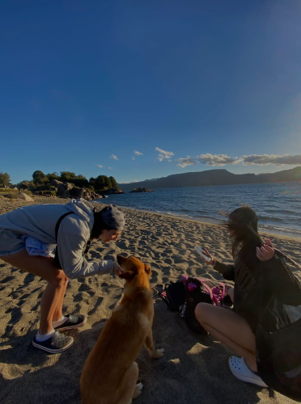

# Presentación - Aitana Arostegui
Hola! Soy Aitana, tengo 21 años, vivo en Campana y actualmente estoy cursando algunas materias de segundo y tercer año. Estuve interesada en programación durante los últimos 2 años del secundario aunque me decidí a estudiar esta carrera a mitad de mi último año aproximadamente, 2020. De vez en cuando hago algún curso online o investigo por mi cuenta distintos lenguajes de programación, como Python o C, que son en los que estuve incursionando este último tiempo.
## Mis hobbies:
  * **Deportes:** 
      * _Handball:_ practico este deporte desde 2016, hasta el año pasado jugué en el Boat Club de Campana. Este año tuve que dejar la actividad porque los horarios de la facultad me coinciden con los de entrenamiento.
      * _Gym:_ además de handball siempre tuve como complemento el gimnasio, tanto por mi cuenta como por la misma parte física de los entrenamientos. Intento ir de 3 a 5 veces en la semana, dependiendo mi disponibilidad de horarios.
  * **Libros:** suelo leer bastante durante las vacaciones de verano que es cuando más tiempo libre tengo. Me gustan bastante los libros sobre misterios o novelas históricas, de todas formas siempre prefiero leer en inglés. No soy tanto de mirar series porque me engancho y las termino al toque pero también me gusta bastante el cine.
  * **Música:** soy de esas personas que hacen todo con música, siempre que puedo estoy con los auriculares puestos, más que nada cuando hago manualidades (otra cosa que disfruto hacer). Tengo un gusto bastante variado la verdad, hoy en día lo que más escucho es Pop y Rock. De más chica fui a una escuela de música y tocaba la guitarra, hoy en día no lo hago seguido pero es algo que me sigue gustando.
  * **Viajar:** creo que es una de mis actividades favoritas,  todos los veranos intento hacer al menos un viaje con mis amigas. A pesar de que ahora está carísimo, lo que me gusta de viajar, además de conocer, recorrer, etc. también es la organización del viaje, soy bastante ordenada por lo cual me gusta planear los viajes, hacer el armado digamos.
  * **Pasear a mis perros:** no sé si lo consideraría como un hobbie pero no sabía donde contarlo sino. Soy amante de los animales, actualmente tengo 3 perros, 2 bastante grandes de tamaño, pero durante toda mi vida mi casa fue un zoológico aprox., tuve como 8 gatos para que se den una idea, la verdad es que disfruto mucho la compañía de los animales.
    > una foto que mezcla de todo un poco: viaje, amigas y animales <3
    
